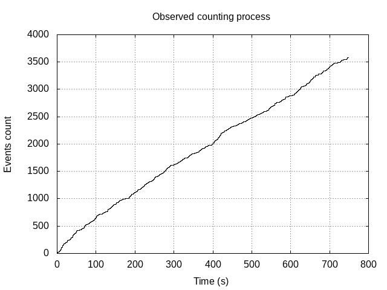
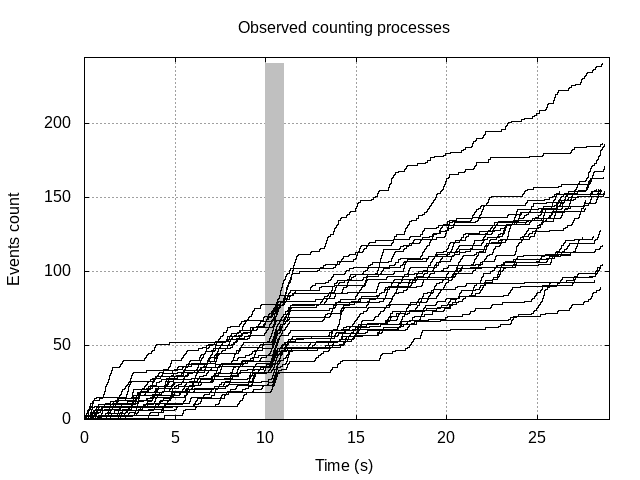
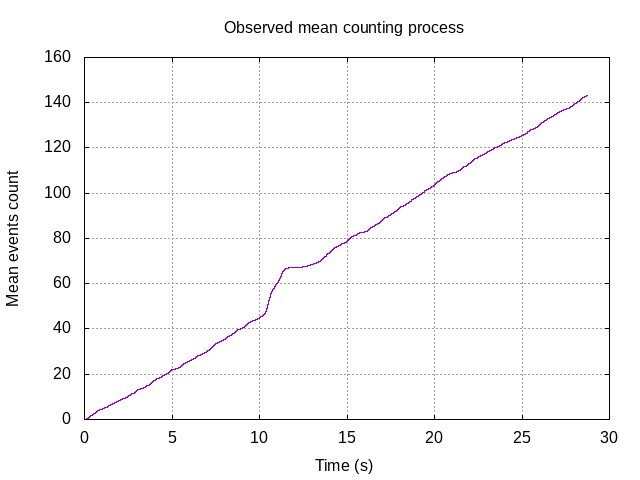
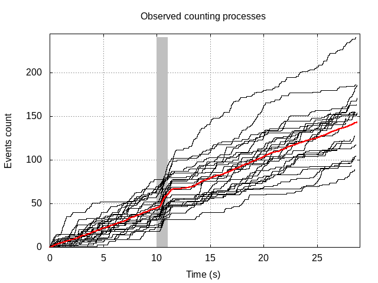
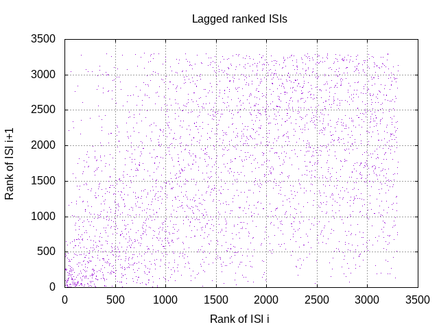

<h2>Table of Contents</h2>

<ul>
<li><a href="#the-idea-motivating-this-development">1. The idea motivating this development</a></li>
<li><a href="#required-software">2. Required software</a>
<ul>
<li><a href="#getting-and-compiling-the-code">2.1. Getting and compiling the code</a></li>
</ul>
</li>
<li><a href="#data-used">3. Data used</a>
<ul>
<li><a href="#getting-a-spike-train">3.1. Getting a spike train</a></li>
</ul>
</li>
<li><a href="#preliminary-analysis">4. Preliminary analysis</a>
<ul>
<li><a href="#reading-the-data">4.1. Reading the data</a></li>
<li><a href="#basic-statistics">4.2. Basic statistics</a></li>
<li><a href="#basic-plots">4.3. Basic plots</a>
<ul>
<li><a href="#orgfa3305b">4.3.1. Raster plot</a></li>
<li><a href="#org36dd715">4.3.2. A fancy trick</a></li>
<li><a href="#org6f898f0">4.3.3. Counting process plots</a></li>
<li><a href="#org6619740">4.3.4. Lagged ranked ISI plot</a></li>
</ul>
</li>
</ul>
</li>
</ul>

# The idea motivating this development

The idea here is to implement the Unix/Linux "philosophy"&#x2013;as exposed
for instance in the article of Arnold Robbins
[*What's GNU*](http://www.linuxjournal.com/article/2762)&#x2013;to the
analysis of neuronal spike trains. Since spike trains make not too
voluminous data, they can be stored as text files (ASCII) and most
operations on them can be designed as "filters", that is programs
(usually but not always written in `C`) that read their input in text
format from the "standard input" (`stdin`) and send their result in text
format to the "standard output" (`stdout`). For graphical displays, we
are going to use [gnuplot](http://gnuplot.info/).

# Required software

The code will be written mostly in `C`. If you want a clear and quick
introduction to this language, check Ben Klemens:
[Modeling With Data](http://modelingwithdata.org/about_the_book.html).
To compile the code you will need a `C` compiler like
[gcc](https://gcc.gnu.org/). If you are using `Linux` or `MacOS` it's
in a package from your favorite distribution, if you are using `Windows`
you will have to install [Cygwin](https://cygwin.com/index.html). The
heavy computational work is going to be performed mainly by the
[gsl](http://www.gnu.org/software/gsl/) (the *GNU Scientific Library*)
that is easily installed through your package manager (from now on, for
windows users, the "package manager" refers to the one of `Cygwin`). The
graphs will be generated with [gnuplot](http://www.gnuplot.info/).
Windows user who want to use the interactive plotting capabilities of
the library (recommended) will also have to install
[`Cygwin/X`](http://x.cygwin.com/).

For now the compilation requires either `make` or [Scons](http://scons.org/).

## Getting and compiling the code

The code is hosted on
[`GitHub`](https://github.com/christophe-pouzat/aspa). The easiest is
to clone or download the repository (there is a button for that on the
GitHub page). Once you have the repository on your hard drive, go to the
code sub-directory and, if using `make`, type:

    cd ../code && make all

    cc `pkg-config --cflags gsl` -g -Wall -O0 -std=gnu11    -c -o aspa_single.o aspa_single.c
    ar cr libaspa.a aspa_single.o
    cc `pkg-config --cflags gsl` -g -Wall -O0 -std=gnu11    -c -o aspa_read_spike_train.o aspa_read_spike_train.c
    cc aspa_read_spike_train.o libaspa.a `pkg-config --libs gsl `  -o aspa_read_spike_train
    cc `pkg-config --cflags gsl` -g -Wall -O0 -std=gnu11    -c -o aspa_mst_fns.o aspa_mst_fns.c
    cc aspa_mst_fns.o libaspa.a `pkg-config --libs gsl `  -o aspa_mst_fns
    cc `pkg-config --cflags gsl` -g -Wall -O0 -std=gnu11    -c -o aspa_mst_aggregate.o aspa_mst_aggregate.c
    cc aspa_mst_aggregate.o libaspa.a `pkg-config --libs gsl `  -o aspa_mst_aggregate
    cc `pkg-config --cflags gsl` -g -Wall -O0 -std=gnu11    -c -o aspa_mst_plot.o aspa_mst_plot.c
    cc aspa_mst_plot.o libaspa.a `pkg-config --libs gsl `  -o aspa_mst_plot

or with `SCons`:

    scons -Q

This will compile the library `libaspa.a` as well as a bunch of user
programs all starting with `aspa_`, like `aspa_read_spike_train`. As
mentioned previously, you need the `gsl` to be installed in order to
compile the code.

Once the compilation is done you should move the user programs to one of
the directories listed on your `PATH`, that is on one of the directories
appearing when you type:

    echo $PATH

    /opt/jython/bin/:/usr/local/sbin:/usr/local/bin:/usr/bin:/usr/lib/jvm/default/bin:/usr/bin/site_perl:/usr/bin/vendor_perl:/usr/bin/core_perl

After that, you're in business.

# Data used

We are going to use spike trains obtained from the antennal lobe&#x2013;the first
olfactory relay&#x2013;of locusts, *Schistocerca americana*. These spike trains
can be found on the
[zenodo-locust-datasets-analysis](https://christophe-pouzat.github.io/zenodo-locust-datasets-analysis/)
GitHub repository. You can also find there a complete description of the
sorting procedure used to go from the raw data, that are available on
[zenodo](https://zenodo.org/record/21589), to the spike trains. We
will mostly use the spike trains from experiment `locust20010214` that
can be found at the following address:
<https://github.com/christophe-pouzat/zenodo-locust-datasets-analysis/tree/master/Locust_Analysis_with_R/locust20010214/locust20010214_spike_trains>.

## Getting a spike train

We will start by downloading the spike train from unit 1 from `group`
`Spontaneous_1`. This is done by typing in the shell (I'm using the
"line continuation character, " to fit my lines on a single page of the
`PDF` version of this document, when typing directly to the shell you
don't need these line breaks):

    wget https://raw.githubusercontent.com/christophe-pouzat/\
    zenodo-locust-datasets-analysis/master/Locust_Analysis_with_R/\
    locust20010214/locust20010214_spike_trains/\
    locust20010214_Spontaneous_1_tetB_u1.txt

    --2017-10-23 21:14:47--  https://raw.githubusercontent.com/christophe-pouzat/zenodo-locust-datasets-analysis/master/Locust_Analysis_with_R/locust20010214/locust20010214_spike_trains/locust20010214_Spontaneous_1_tetB_u1.txt
    Certificat de l'autorité de certification « /etc/ssl/certs/ca-certificates.crt » chargé
    Résolution de raw.githubusercontent.com… 151.101.92.133
    Connexion à raw.githubusercontent.com|151.101.92.133|:443… connecté.
    requête HTTP transmise, en attente de la réponse… 200 OK
    Taille : 27743 (27K) [text/plain]
    Sauvegarde en : « locust20010214_Spontaneous_1_tetB_u1.txt »
    
         0K .......... .......... .......                         100%  957K=0,03s
    
    2017-10-23 21:14:47 (957 KB/s) — « locust20010214_Spontaneous_1_tetB_u1.txt » sauvegardé [27743/27743]

This "spike train" contains in fact the result of 30 consecutive
continuous acquisitions, each 29 s long with a 1 s gap in between, as is
made clear in the
[detailed
sorting description](https://christophe-pouzat.github.io/zenodo-locust-datasets-analysis/Locust_Analysis_with_R/locust20010214/Sorting_20010214_tetB.html) of this data set.

# Preliminary analysis

## Reading the data

In is not expected that the data (spike trains) one wants to work with
will be obtained in any standard format. That means that a usually
slightly "painful" work will be required (but that's always the case
when dealing with actual data) to read the data and reformat them in the
text (or binary) format used by `aspa`. Looking at the source code of
`aspa_read_spike_train` is the way to proceed (more specifically, look
at the code of `aspa_raw_fscanf` that is called by
`aspa_read_spike_train` and that is found in `aspa_single.c`).

The data we just downloaded are collections of spike times in "sample
times"&#x2013;the time unit is therefore not the second but 1/15000
second&#x2013;with one spike time per line. This can be seen by calling first
the `head` function (showing by default the first ten lines of the
file):

    head locust20010214_Spontaneous_1_tetB_u1.txt

    4364.629
    49876.8
    50529.95
    50988.26
    51371.66
    51769.29
    52703.77
    54772.34
    56472.7
    71766.51

Calling `tail` shows the last lines of the file (by default the last ten
lines):

    tail locust20010214_Spontaneous_1_tetB_u1.txt

    13442792
    13455679
    13458610
    13460049
    13460517
    13461154
    13464139
    13470059
    13471539
    13472243

Function `aspa_read_spike_train` will read these times from the `stdin`
and output them in a "nice" format (still a text file by default) to the
`stdout`. You can get a description to arguments accepted by the
function by calling it with the `--help` argument:

    ./aspa_read_spike_train --help

    Usage: 
      --in_bin: specify binary data input
      --out_bin: specify binary data output
      --sample2second <positive real>: the factor by which times
      in input data are divided in order get spike times in seconds
      used only when reading 'raw' data (default 15000)
      --inter_trial_interval <positive real>: the inter trial
      interval (in s) used only when reading 'raw' data
      --trial_duration <positive real>: the recorded duration
      (in s) of each trial used only when reading 'raw' data
      --stim_onset <real>: the stimulus onset time
      (in s) if that makes sense, used only when reading 'raw' data
      --stim_offset <real>: the stimulus offset time
      (in s) if that makes sense, used only when reading 'raw' data

For demonstration we can call it on the data file we just downloaded
(`locust20010214_Spontaneous_1_tetB_u1.txt`), writing the result into a
new text file `locust20010214_Spontaneous_1_tetB_u1.aspa` for further
inspection:

    ./aspa_read_spike_train --inter_trial_interval=30 --trial_duration=29 < \
    locust20010214_Spontaneous_1_tetB_u1.txt > \
    locust20010214_Spontaneous_1_tetB_u1.aspa

We can then look at the first 25 lines of our new file with:

    head -n 25 locust20010214_Spontaneous_1_tetB_u1.aspa 

    # Number of trials: 28
    # Number of aggregated trials: 1
    # Stimulus onset: 0 (s)
    # Stimulus offset: 0 (s)
    # Single trial duration: 29 (s)
    
    
    # Start of trial: 0
    # Trial start time: 0 (s)
    # Number of spikes: 94
    0.290975
    3.32512
    3.36866
    3.39922
    3.42478
    3.45129
    3.51358
    3.65149
    3.76485
    4.78443
    5.06381
    5.11507
    5.24077
    5.28448
    5.31933

We see that the "non-data" element are on lines starting with a "#"
character. The "head" of the file specifies how many trial are in the
file and gives some other information. The data from trial 0 (we start
counting at 0) com next after two blank lines. To see the whole file
interactively you can type:

    less locust20010214_Spontaneous_1_tetB_u1.aspa 

## Basic statistics

Program `aspa_mst_fns` (`mst` stands for "multiple spike trains" and
`fns` for "[Five-number summary](https://en.wikipedia.org/wiki/Five-number_summary)") return elementary statics related to a spike train data set.
A description of its use is obtained by calling the program with the `--help` argument:

    ./aspa_mst_fns --help

    Usage: 
      --in_bin: specify binary data input
    
    Returns five number summary and additional stats.

We can call this function directly on the output of `aspa_read_spike_train` using a [pipe](http://www.linfo.org/pipe.html) with:

    ./aspa_read_spike_train --inter_trial_interval=30 --trial_duration=29 < \
    locust20010214_Spontaneous_1_tetB_u1.txt | \
    ./aspa_mst_fns

    Data from 28 trials.
    The mean rate is: 4.10222 Hz.
    The inter spike interval statistics are:
      The sample contains 3303 elements.
      The mean and SD are   : 0.2333 and 0.4660.
      The median and MAD are: 0.0546 and 0.0359.
    The five number summary:
      Min.   1st qrt Median 3rd qrt Max. 
      0.0157 0.0369  0.0546 0.1491  4.5264
    A 95% confidence interval for the lag 1 Spearman rank correlation is: [0.400336,0.443483].

## Basic plots

There are several plots one might want to create at an early stage of spike train data analysis. Since most of these plots are more "attractive" when built from data with a response to a stimulus, we will start by getting one such case (from the same experiment and same neuron):

    wget https://raw.githubusercontent.com/christophe-pouzat/\
    zenodo-locust-datasets-analysis/master/Locust_Analysis_with_R/\
    locust20010214/locust20010214_spike_trains/\
    locust20010214_C3H_1_tetB_u1.txt

    --2017-10-23 20:53:00--  https://raw.githubusercontent.com/christophe-pouzat/zenodo-locust-datasets-analysis/master/Locust_Analysis_with_R/locust20010214/locust20010214_spike_trains/locust20010214_C3H_1_tetB_u1.txt
    Certificat de l'autorité de certification « /etc/ssl/certs/ca-certificates.crt » chargé
    Résolution de raw.githubusercontent.com… 151.101.92.133
    Connexion à raw.githubusercontent.com|151.101.92.133|:443… connecté.
    requête HTTP transmise, en attente de la réponse… 200 OK
    Taille : 29318 (29K) [text/plain]
    Sauvegarde en : « locust20010214_C3H_1_tetB_u1.txt.1 »
    
         0K .......... .......... ........                        100% 1,75M=0,02s
    
    2017-10-23 20:53:01 (1,75 MB/s) — « locust20010214_C3H_1_tetB_u1.txt.1 » sauvegardé [29318/29318]

This file contains the responses to 25 stimulations with `cis-3-hexen-1-ol`. The classical way of displaying such data is the `raster plot`. This plot as well as several over ones we will shortly see is generated by calling `aspa_mst_plot`. As usual, calling the function with argument `--help` gives us a basic explanation on how to use it:

    ./aspa_mst_plot --help

    Usage: 
      --in_bin: specify binary data input
      --text: specify text output
      --what <string>: one of 'raster', 'cp_rt', 'cp_wt',
      'cp_norm', 'lrank', the type of plot (see bellow)
      --lag <positive integer>: the lag used in lagged
        ranked plots (default at 1).
    
    An interactive plot is generated.
    If what is set to 'raster' a raster plot is generated.
    If what is set to 'cp_rt' the observed counting process
    in 'real' time is generated, that is trial appear one after
    the other.
    If what is set to 'cp_wt' the observed counting processes
    corresponding to each trial are shown on the 'within trial time'.
    If what is set to 'cp_norm' the normalized aggregated counting
    process is displayed (normalization means here that the step size
    due to each spike in each trial is 1/number of trials; in a sense
    the 'mean' counting process is displayed).
    If what is set to 'lrank', isi are ranked from the smallest to
    the largest and the rank of isi i+lag is plotted against the
    lag of isi i.

### Raster plot

Here, to get the classical raster we do:

    ./aspa_read_spike_train --inter_trial_interval=30 --trial_duration=29 \
    --stim_onset=10 --stim_offset=11 < \
    locust20010214_C3H_1_tetB_u1.txt | \
    ./aspa_mst_plot --what=raster

This will make a new window appear with a plot similar to the one we will now construct after calling the function with an additional argument (you can type `q` to kill the plot window):

    ./aspa_read_spike_train --inter_trial_interval=30 --trial_duration=29 \
    --stim_onset=10 --stim_offset=11 < \
    locust20010214_C3H_1_tetB_u1.txt | \
    ./aspa_mst_plot --what=raster --text > \
    locust20010214_C3H_1_tetB_u1.raster

Here instead of the "new window output" we generated at text output (that's what the `--text` argument means) sent to the `stdout` and redirected this `stdout` to a file called `locust20010214_C3H_1_tetB_u1.raster`. We can now build "by hand" with `gnuplot` the same figure as the one we directly got (we have now more control on the output):

    set grid
    unset key
    set xlabel 'Time (s)'
    set ylabel 'Trial'
    plot [0:30] [0:26] 'locust20010214_C3H_1_tetB_u1.raster' \
         index 0 using 1:2 with filledcurve closed lc 'grey',\
         '' index 1:25 using 1:2 with dots lc 'black'

### A fancy trick

We can also make the raster plot and get the basic stats printed at once with the [tee](https://www.gnu.org/software/coreutils/manual/html_node/tee-invocation.html) command as follows:

    ./aspa_read_spike_train --inter_trial_interval=30 --trial_duration=29 < \
    locust20010214_C3H_1_tetB_u1.txt | tee >(aspa_mst_plot --what=raster) | \
    ./aspa_mst_fns

### Counting process plots

There are several ways to create a "counting process" plot. The first one, used mainly for checking data stationarity is building the "true" observed counting process plot, that is at each spike time the step function jumps by one unit and successive trials are shown one after the other as they *actually* occurred. This is what is specified with argument `cp_rt` to option `what`:

    ./aspa_read_spike_train --inter_trial_interval=30 --trial_duration=29 \
    --stim_onset=10 --stim_offset=11 < \
    locust20010214_C3H_1_tetB_u1.txt | \
    ./aspa_mst_plot --what=cp_rt

Giving a plot looking like:

We might also want to look at the individual observed counting processes after realigning them on the stimulus onset. This is obtained with argument `cp_wt` to option `what`:

    ./aspa_read_spike_train --inter_trial_interval=30 --trial_duration=29 < \
    locust20010214_C3H_1_tetB_u1.txt | \
    ./aspa_mst_plot --what=cp_wt

resulting in a plot looking like:

We can also decide that to see if there is a response or not, we can construct the average step function. That is, we replace the step size in the previous plot by 1/N (N is the number of trials) and we sum all these resulting step functions. This is done with argument `cp_norm` to option `what`:

    ./aspa_read_spike_train --inter_trial_interval=30 --trial_duration=29 \
    --stim_onset=10 --stim_offset=11 < \
    locust20010214_C3H_1_tetB_u1.txt | \
    ./aspa_mst_plot --what=cp_norm

resulting in a plot looking like:

One might want to prepare a more sophisticated plot for, say, a publication showing both the individual observed counting processes and their average. This could be done as follows, by creating first some files with the "properly" formated data:

    ./aspa_read_spike_train --inter_trial_interval=30 --trial_duration=29 \
    --stim_onset=10 --stim_offset=11 < \
    locust20010214_C3H_1_tetB_u1.txt > \
    locust20010214_C3H_1_tetB_u1.aspa
    
    ./aspa_mst_plot --what=cp_norm --text < \
    locust20010214_C3H_1_tetB_u1.aspa > \
    locust20010214_C3H_1_tetB_u1.cp_norm
    
    ./aspa_mst_plot --what=cp_wt --text < \
    locust20010214_C3H_1_tetB_u1.aspa > \
    locust20010214_C3H_1_tetB_u1.cp_wt

Then within `gnuplot`:

    set grid
    unset key
    set xlabel 'Time (s)'
    set title 'Observed counting processes'
    set ylabel 'Events count'
    plot [0:29] [0:245] 'locust20010214_C3H_1_tetB_u1.cp_wt' \
         index 0 using 1:2 with filledcurve closed lc 'grey',\
         '' index 1:25 using 1:2 with steps lc 'black',\
         'locust20010214_C3H_1_tetB_u1.cp_norm' index 1 \
         using 1:2 with steps lc 'red' linewidth 2

### Lagged ranked ISI plot

Coming back to the spontaneous data, a good graphical way to look for correlations between successive inter spike intervals is to rank them (from the smallest to the largest) before plotting the rank of interval i+lag against the rank of interval i. We can do that with the spontaneous data as follows:

    ./aspa_read_spike_train --inter_trial_interval=30 --trial_duration=29 --stim_onset=10 --stim_offset=11 < \ locust20010214_Spontaneous_1_tetB_u1.txt | ./aspa_mst_plot --what=lrank

We then obtain a graph looking like:

